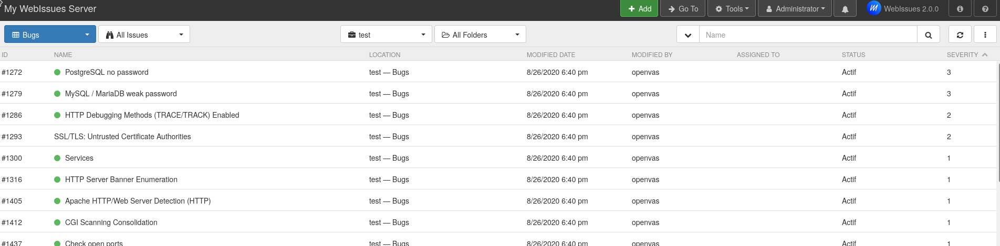

# Security-bugtracker
> A tool to run security tools and track security bugs easily

Security-bugtracker is just a plugin of the awesome [webissues](https://github.com/mimecorg/webissues) bugtracker.  

## Supported tools
- [OpenVAS](https://www.openvas.org/)
- [DependencyCheck](https://github.com/jeremylong/DependencyCheck)
- [Arachni](https://www.arachni-scanner.com/)
- [SonarQube](https://www.sonarqube.org/)
- [Sslscan](https://github.com/rbsec/sslscan)
- [Owasp ZAP](https://www.zaproxy.org/)

## Installation
Change, at the top of `docker-compose.yml` file, the default credential to secure values.

Use `docker-compose` to build the docker images and run the containers:
```
docker-compose build
docker-compose up
```

Go to http://localhost:1080/setup/install.php and complete the installation of webissues (you just have to create an administrator account on the last screen of the setup) then go to http://localhost:1080/client/securityplugin.php and install the "webissues security plugin".

Login to webissues as administrator and create a normal account with username and password equals to `OPENVAS_WEBISSUES_USERNAME` and `OPENVAS_WEBISSUES_PASSWORD` defined in the `docker-compose.yml` file.

## Configuration
The first time, after the installation, run:
```
docker exec --user gvm -it security-bugtracker_securitytools_1 /opt/gvm/update_openvas.sh
docker exec --user gvm -it security-bugtracker_securitytools_1 /opt/gvm/create_config_gvm.sh
```

Remember the scan config id printed on the console when running `/create_config_gvm.sh` script.

Note: `update_openvas.sh` script updates openvas database, it can take more than one hour to end.

To update openvas database, from time to time, use only:
```
docker exec --user gvm -it security-bugtracker_securitytools_1 /opt/gvm/update_openvas.sh
```

## Run security scans

### With SOAP-UI

Use your favorite SOAP client to request (with administrator credentials / basic authentication) security bugtracker webservices:
* the first request is to create a project named "test"
* the second request is to add `OPENVAS_WEBISSUES_USERNAME` (retrieve its id in the webissues UI) as a member of this project.
* the third request is to add a server to scan.
* and the last request is to run the scan (pay attention to the `id_config_openvas` element which corresponds to the recommended scan config id created during the previous configuration).


When a OpenVAS scan ends, the corresponding issues will be automatically added to bugs folder of your project:



### With a script

Some scripts are available in the [security_tools/jobs](./security_tools/jobs) folder to automate large security scans.  
For instance [run_openvas.php](./security_tools/jobs/run_openvas.php) script will read all assets (ips, hostnames, corresponding projects) from text files in the [data](./security_tools/jobs/data/) folder and create "*projects*" in security-bugtracker, "*servers* issues", "*web* issues" (hostnames) and "*scans* issues" (therefore OpenVAS scans will be automatically started with all this data).


